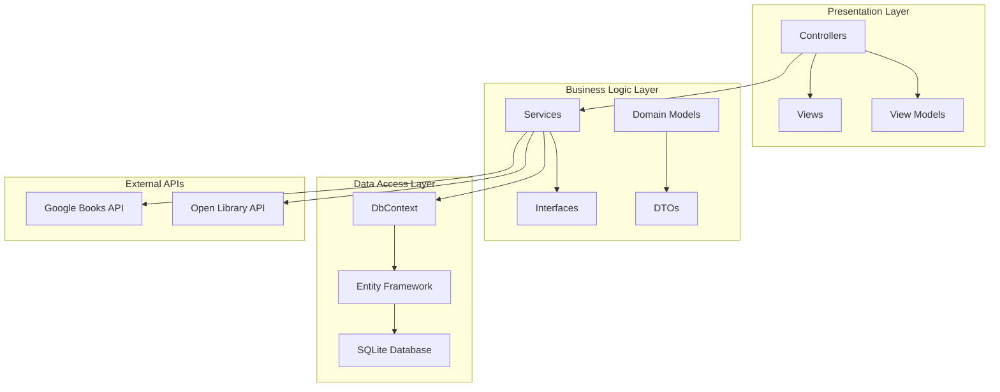
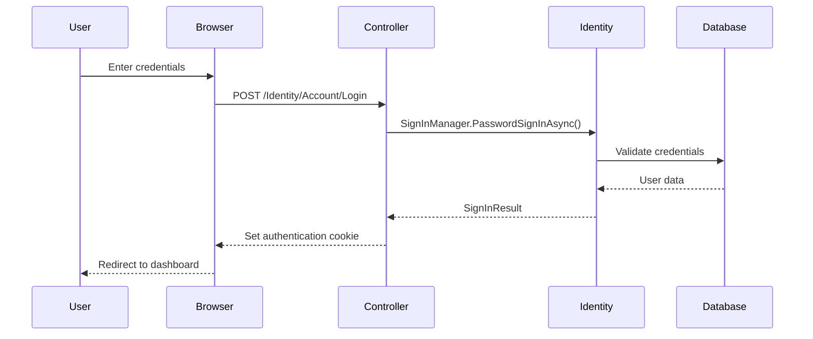
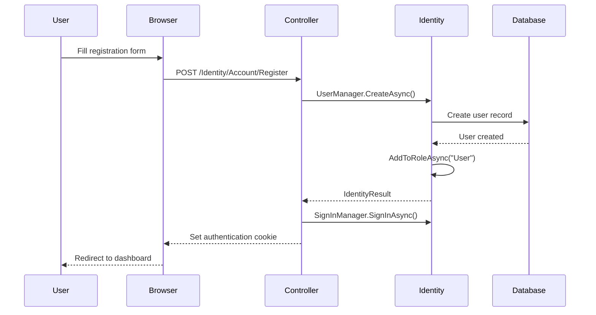

# 📚 LibraryX - Advanced Digital Library Platform

<div align="center">


> _Revolutionizing digital reading through cutting-edge technology and intelligent design_

[](https://dotnet.microsoft.com/en-us/apps/aspnet)
[](https://docs.microsoft.com/en-us/ef/)
[](https://www.sqlite.org/)
[](https://tailwindcss.com/)
[](https://opensource.org/licenses/MIT)

[](https://github.com/biodun42/LibraryX)
[](https://github.com/biodun42/LibraryX)
[](https://github.com/biodun42/LibraryX)

</div>

---

## 📋 Table of Contents

<details>
<summary><strong>Click to expand navigation</strong></summary>

- [🌟 Platform Overview](#-platform-overview)
  - [🎯 Core Mission](#-core-mission)
  - [🚀 Key Capabilities](#-key-capabilities)
- [🏗️ Enterprise Architecture](#️-enterprise-architecture)
  - [🎨 Frontend Excellence](#-frontend-excellence)
  - [⚡ Backend Powerhouse](#-backend-powerhouse)
  - [🗄️ Data Layer](#️-data-layer)
  - [🌐 Integration Layer](#-integration-layer)
- [🚀 Advanced Features Ecosystem](#-advanced-features-ecosystem)
  - [📚 Intelligent Library Management](#-intelligent-library-management)
  - [🔍 Multi-API Search](#-multi-api-search)
  - [💾 Download System](#-download-system)
  - [👤 User Experience](#-user-experience)
- [📐 System Architecture Deep Dive](#-system-architecture-deep-dive)
  - [🏛️ MVC Architecture Overview](#️-mvc-architecture-overview)
  - [🔄 Request Lifecycle](#-request-lifecycle)
  - [🚀 Application Startup](#-application-startup)
- [📊 Database Schema Architecture](#-database-schema-architecture)
- [🌐 API Integration Layer](#-api-integration-layer)
- [🎨 Frontend Architecture & Design System](#-frontend-architecture--design-system)
- [🔐 Security & Compliance Framework](#-security--compliance-framework)
- [📈 Performance Monitoring](#-performance-monitoring)
- [📡 API Documentation & Integration](#-api-documentation--integration)
- [🔧 Development & Testing Guide](#-development--testing-guide)
- [🧪 Testing & Quality Assurance](#-testing--quality-assurance)
- [🚀 Deployment & Production Guide](#-deployment--production-guide)
- [🛠️ Troubleshooting Guide](#️-troubleshooting-guide)
- [🗺️ Project Roadmap](#️-project-roadmap)
- [🤝 Contributing Guidelines](#-contributing-guidelines)
- [📄 License & Legal](#-license--legal)
- [👥 Contributors & Acknowledgments](#-contributors--acknowledgments)

</details>

---

## 🌟 Platform Overview

**LibraryX** represents the next generation of digital library management, architected with enterprise-grade ASP.NET Core 9.0 and featuring sophisticated API integrations that aggregate millions of literary works from diverse sources. This platform transcends traditional library systems by offering an immersive, intelligent reading ecosystem.

### 🎯 **Core Mission**

_Democratizing access to knowledge through intelligent curation, seamless discovery, and personalized reading experiences._

### 🚀 **Key Capabilities**

<div align="center">

| Feature                       | Description                                    | Technology                   |
| ----------------------------- | ---------------------------------------------- | ---------------------------- |
| 🔍 **Intelligent Discovery**  | AI-powered search across multiple APIs         | Google Books + Open Library  |
| 📚 **Collection Management**  | Personalized libraries with smart organization | Entity Framework Core        |
| 💾 **Multi-format Downloads** | Support for PDF, EPUB, and web formats         | Cross-platform compatibility |
| 🎨 **Adaptive Interface**     | Responsive design with accessibility focus     | TailwindCSS + Custom CSS     |
| 🔐 **Enterprise Security**    | Role-based access with subscription tiers      | ASP.NET Core Identity        |
| 📊 **Analytics Dashboard**    | Reading insights and progress tracking         | Real-time data visualization |

</div>

---

## 🏗️ **Enterprise Architecture**

### **🎨 Frontend Excellence**

```typescript
// Modern Tech Stack
Frontend: {
  Framework: "TailwindCSS 3.0",
  JavaScript: "Vanilla ES6+ with async/await",
  Icons: "Font Awesome 5 Pro",
  Animations: "Custom CSS3 with hardware acceleration",
  Responsive: "Mobile-first with fluid breakpoints"
}
```

### **⚡ Backend Powerhouse**

```csharp
// Enterprise-Grade Foundation
Backend: {
  Framework: "ASP.NET Core 9.0 MVC",
  Database: "SQLite with Entity Framework Core",
  Authentication: "ASP.NET Core Identity",
  Architecture: "Clean Architecture with SOLID principles",
  Patterns: "Repository, Service Layer, CQRS"
}
```

### **🗄️ Data Layer**

```sql
-- User Management (ASP.NET Core Identity)
Users {
    Id: NVARCHAR(450) PRIMARY KEY
    UserName: NVARCHAR(256)
    Email: NVARCHAR(256)
    FirstName: NVARCHAR(100)
    LastName: NVARCHAR(100)
    RegistrationDate: DATETIME2
    ProfileImageUrl: NVARCHAR(500)
    EmailNotificationsEnabled: BIT
}

-- Book Collections
SavedBooks {
    Id: INTEGER PRIMARY KEY AUTOINCREMENT
    UserId: NVARCHAR(450) FOREIGN KEY → AspNetUsers.Id
    BookId: NVARCHAR(200) NOT NULL
    Title: NVARCHAR(500) NOT NULL
    Authors: NVARCHAR(1000)
    Description: TEXT
    ThumbnailUrl: NVARCHAR(500)
    Source: NVARCHAR(50) -- 'GoogleBooks' | 'OpenLibrary'
    SavedDate: DATETIME2 DEFAULT CURRENT_TIMESTAMP
    Categories: NVARCHAR(500)
    AverageRating: REAL
    RatingsCount: INTEGER
}

DownloadedBooks {
    Id: INTEGER PRIMARY KEY AUTOINCREMENT
    UserId: NVARCHAR(450) FOREIGN KEY → AspNetUsers.Id
    BookId: NVARCHAR(200) NOT NULL
    Title: NVARCHAR(500) NOT NULL
    Authors: NVARCHAR(1000)
    Format: NVARCHAR(50) -- 'PDF' | 'EPUB' | 'MOBI'
    SourceType: NVARCHAR(50)
    DownloadDate: DATETIME2 DEFAULT CURRENT_TIMESTAMP
    CoverImageUrl: NVARCHAR(500)
    BookUrl: NVARCHAR(1000)
}

-- Subscription Management
UserSubscriptions {
    Id: INTEGER PRIMARY KEY AUTOINCREMENT
    UserId: NVARCHAR(450) UNIQUE FOREIGN KEY → AspNetUsers.Id
    SubscriptionType: NVARCHAR(50) NOT NULL -- 'Basic' | 'Premium' | 'Enterprise'
    SubscriptionDate: DATETIME2 NOT NULL
    ExpirationDate: DATETIME2 NOT NULL
    IsActive: BIT DEFAULT 1
    SubscriptionDetails: TEXT -- JSON formatted
}
```

### **🌐 Integration Layer**

```json
{
  "integrations": {
    "google_books": {
      "endpoint": "https://www.googleapis.com/books/v1/",
      "features": ["search", "details", "preview"],
      "rate_limiting": "exponential_backoff"
    },
    "open_library": {
      "endpoint": "https://openlibrary.org/",
      "features": ["works", "authors", "subjects"],
      "caching": "memory_cache_with_sliding_expiration"
    }
  }
}
```

---

## 🚀 **Advanced Features Ecosystem**

<details>
<summary><strong>📚 Core Library Management</strong></summary>

### **Smart Collection System**

- **Intelligent Categorization**: Auto-tagging with ML-powered genre detection
- **Advanced Search**: Multi-dimensional filtering with boolean operators
- **Personalized Recommendations**: Collaborative filtering algorithms
- **Reading Progress Tracking**: Seamless sync across devices

### **Download & Format Management**

- **Multi-format Support**: PDF, EPUB, MOBI compatibility
- **Offline Reading**: Progressive download with local storage
- **Quality Optimization**: Adaptive image compression
- **Version Control**: Track book updates and revisions

</details>

<details>
<summary><strong>🔐 Enterprise Security Framework</strong></summary>

### **Authentication & Authorization**

- **Multi-factor Authentication**: TOTP and SMS verification
- **Role-based Access Control**: Granular permission management
- **Session Management**: Secure token handling with refresh mechanisms
- **Password Security**: Argon2 hashing with salt generation

### **Data Protection**

- **GDPR Compliance**: Data anonymization and right-to-be-forgotten
- **SSL/TLS Encryption**: End-to-end data protection
- **Input Validation**: Comprehensive XSS and SQL injection prevention
- **Audit Logging**: Complete activity trail for compliance

</details>

<details>
<summary><strong>🎯 Premium Subscription Tiers</strong></summary>

### **Flexible Monetization Model**

| Tier           | Features                         | API Limits        | Storage |
| -------------- | -------------------------------- | ----------------- | ------- |
| **Free**       | Basic search, 5 downloads/month  | 100 requests/day  | 100MB   |
| **Premium**    | Unlimited downloads, Collections | 1000 requests/day | 1GB     |
| **Enterprise** | Advanced analytics, API access   | Unlimited         | 10GB    |

</details>

---

## 📐 **System Architecture Deep Dive**

### **🏛️ MVC Architecture Pattern**

LibraryX follows the **Model-View-Controller (MVC)** architectural pattern with **Clean Architecture** principles:



### **🔄 Request Lifecycle**

1. **Client Request** → Route Resolution → Controller Action
2. **Service Layer** → Business Logic Processing → API Calls
3. **Data Layer** → Entity Framework → SQLite Operations
4. **View Rendering** → Model Binding → HTML Response

### **🚀 Application Startup Architecture**

```csharp
// Program.cs - Application Bootstrap Configuration
public class Startup
{
    public void ConfigureServices(IServiceCollection services)
    {
        // 1. Database Configuration
        services.AddDbContext<ApplicationDbContext>(options =>
            options.UseSqlite(connectionString));

        // 2. Identity Framework Setup
        services.AddDefaultIdentity<ApplicationUser>(options =>
        {
            // Security Configuration
            options.Password.RequiredLength = 6;
            options.SignIn.RequireConfirmedEmail = false;
            options.User.RequireUniqueEmail = true;
        })
        .AddEntityFrameworkStores<ApplicationDbContext>();

        // 3. Cookie Authentication
        services.ConfigureApplicationCookie(options =>
        {
            options.Cookie.HttpOnly = true;
            options.ExpireTimeSpan = TimeSpan.FromDays(14);
            options.LoginPath = "/Identity/Account/Login";
            options.SlidingExpiration = true;
        });

        // 4. Dependency Injection Registration
        services.AddHttpClient<IBookService, BookService>();
        services.AddScoped<IBookService, BookService>();
        services.AddHttpClient<IOpenLibraryService, OpenLibraryService>();
        services.AddScoped<IOpenLibraryService, OpenLibraryService>();

        // 5. MVC Configuration
        services.AddControllersWithViews();
    }

    public void Configure(IApplicationBuilder app, IWebHostEnvironment env)
    {
        // Middleware Pipeline Configuration
        if (env.IsDevelopment())
        {
            app.UseMigrationsEndPoint();
        }
        else
        {
            app.UseExceptionHandler("/Home/Error");
            app.UseHsts();
        }

        app.UseHttpsRedirection();
        app.UseStaticFiles();
        app.UseRouting();
        app.UseAuthentication();
        app.UseAuthorization();

        app.MapControllerRoute(
            name: "default",
            pattern: "{controller=Home}/{action=Index}/{id?}");
        app.MapRazorPages();
    }
}
```

---

## 📊 **Database Schema Architecture**

### **🗄️ Core Entities**

```sql
-- User Management (ASP.NET Core Identity)
Users {
    Id: NVARCHAR(450) PRIMARY KEY
    UserName: NVARCHAR(256)
    Email: NVARCHAR(256)
    FirstName: NVARCHAR(100)
    LastName: NVARCHAR(100)
    RegistrationDate: DATETIME2
    ProfileImageUrl: NVARCHAR(500)
    EmailNotificationsEnabled: BIT
}

-- Book Collections
SavedBooks {
    Id: INTEGER PRIMARY KEY AUTOINCREMENT
    UserId: NVARCHAR(450) FOREIGN KEY → AspNetUsers.Id
    BookId: NVARCHAR(200) NOT NULL
    Title: NVARCHAR(500) NOT NULL
    Authors: NVARCHAR(1000)
    Description: TEXT
    ThumbnailUrl: NVARCHAR(500)
    Source: NVARCHAR(50) -- 'GoogleBooks' | 'OpenLibrary'
    SavedDate: DATETIME2 DEFAULT CURRENT_TIMESTAMP
    Categories: NVARCHAR(500)
    AverageRating: REAL
    RatingsCount: INTEGER
}

DownloadedBooks {
    Id: INTEGER PRIMARY KEY AUTOINCREMENT
    UserId: NVARCHAR(450) FOREIGN KEY → AspNetUsers.Id
    BookId: NVARCHAR(200) NOT NULL
    Title: NVARCHAR(500) NOT NULL
    Authors: NVARCHAR(1000)
    Format: NVARCHAR(50) -- 'PDF' | 'EPUB' | 'MOBI'
    SourceType: NVARCHAR(50)
    DownloadDate: DATETIME2 DEFAULT CURRENT_TIMESTAMP
    CoverImageUrl: NVARCHAR(500)
    BookUrl: NVARCHAR(1000)
}

-- Subscription Management
UserSubscriptions {
    Id: INTEGER PRIMARY KEY AUTOINCREMENT
    UserId: NVARCHAR(450) UNIQUE FOREIGN KEY → AspNetUsers.Id
    SubscriptionType: NVARCHAR(50) NOT NULL -- 'Basic' | 'Premium' | 'Enterprise'
    SubscriptionDate: DATETIME2 NOT NULL
    ExpirationDate: DATETIME2 NOT NULL
    IsActive: BIT DEFAULT 1
    SubscriptionDetails: TEXT -- JSON formatted
}
```

### **🔗 Entity Relationships**

```csharp
// One-to-Many Relationships
User ←→ SavedBooks (1:N)
User ←→ DownloadedBooks (1:N)

// One-to-One Relationship
User ←→ UserSubscription (1:1)

// Many-to-Many (via Identity Framework)
Users ←→ Roles (M:N through AspNetUserRoles)
```

---

## 🌐 **API Integration Layer**

### **📖 Google Books API Service**

```csharp
public class BookService
{
    private readonly HttpClient _httpClient;
    private readonly IMemoryCache _cache;
    private readonly ILogger<BookService> _logger;

    // Core Search Functionality
    public async Task<BookSearchResult> SearchBooksAsync(
        string query,
        string category = null,
        int startIndex = 0,
        int maxResults = 10)
    {
        var cacheKey = $"search_{query}_{category}_{startIndex}_{maxResults}";

        if (_cache.TryGetValue(cacheKey, out BookSearchResult cachedResult))
            return cachedResult;

        var requestUrl = BuildSearchUrl(query, category, startIndex, maxResults);
        var response = await _httpClient.GetAsync(requestUrl);

        if (response.IsSuccessStatusCode)
        {
            var jsonContent = await response.Content.ReadAsStringAsync();
            var result = JsonSerializer.Deserialize<BookSearchResult>(jsonContent);

            _cache.Set(cacheKey, result, TimeSpan.FromMinutes(15));
            return result;
        }

        return new BookSearchResult { Items = new List<Book>(), TotalItems = 0 };
    }

    // Advanced Book Details Retrieval
    public async Task<Book> GetBookByIdAsync(string bookId)
    {
        var cacheKey = $"book_details_{bookId}";

        if (_cache.TryGetValue(cacheKey, out Book cachedBook))
            return cachedBook;

        var requestUrl = $"https://www.googleapis.com/books/v1/volumes/{bookId}";
        var response = await _httpClient.GetAsync(requestUrl);

        if (response.IsSuccessStatusCode)
        {
            var jsonContent = await response.Content.ReadAsStringAsync();
            var book = JsonSerializer.Deserialize<Book>(jsonContent);

            _cache.Set(cacheKey, book, TimeSpan.FromHours(1));
            return book;
        }

        return null;
    }

    // Intelligent Recommendation Engine
    public async Task<List<Book>> GetRelatedBooksAsync(
        Book sourceBook,
        int maxResults = 6)
    {
        var relatedBooks = new List<Book>();

        // Strategy 1: Same categories
        if (sourceBook.VolumeInfo?.Categories?.Any() == true)
        {
            var categoryBooks = await SearchByCategories(
                sourceBook.VolumeInfo.Categories,
                maxResults / 2);
            relatedBooks.AddRange(categoryBooks);
        }

        // Strategy 2: Same author
        if (sourceBook.VolumeInfo?.Authors?.Any() == true)
        {
            var authorBooks = await SearchByAuthor(
                sourceBook.VolumeInfo.Authors.First(),
                maxResults / 2);
            relatedBooks.AddRange(authorBooks);
        }

        return relatedBooks.DistinctBy(b => b.Id).ToList();
    }
}
```

### **📚 Open Library API Service**

```csharp
public class OpenLibraryService
{
    private readonly HttpClient _httpClient;
    private readonly ILogger<OpenLibraryService> _logger;

    // Comprehensive Search Implementation
    public async Task<OpenLibrarySearchResponse> SearchBooksAsync(
        string query,
        string subject = null,
        int page = 1,
        int limit = 10)
    {
        var searchParams = new List<string>();

        if (!string.IsNullOrEmpty(query))
            searchParams.Add($"q={Uri.EscapeDataString(query)}");

        if (!string.IsNullOrEmpty(subject))
            searchParams.Add($"subject={Uri.EscapeDataString(subject)}");

        searchParams.Add($"page={page}");
        searchParams.Add($"limit={limit}");
        searchParams.Add("fields=key,title,author_name,first_publish_year,cover_i,isbn,subject,publisher,language");

        var requestUrl = $"https://openlibrary.org/search.json?{string.Join("&", searchParams)}";

        try
        {
            var response = await _httpClient.GetAsync(requestUrl);
            response.EnsureSuccessStatusCode();

            var jsonContent = await response.Content.ReadAsStringAsync();
            var searchResult = JsonSerializer.Deserialize<OpenLibrarySearchResponse>(
                jsonContent,
                new JsonSerializerOptions { PropertyNameCaseInsensitive = true });

            return searchResult ?? new OpenLibrarySearchResponse
            {
                Docs = new List<OpenLibraryBook>(),
                NumFound = 0
            };
        }
        catch (Exception ex)
        {
            _logger.LogError(ex, "Error searching Open Library with query: {Query}", query);
            return new OpenLibrarySearchResponse
            {
                Docs = new List<OpenLibraryBook>(),
                NumFound = 0
            };
        }
    }

    // Advanced Work Details Retrieval
    public async Task<OpenLibraryBookDetails> GetBookDetailsByKeyAsync(string workKey)
    {
        if (!workKey.StartsWith("/works/"))
            workKey = $"/works/{workKey}";

        var requestUrl = $"https://openlibrary.org{workKey}.json";

        try
        {
            var response = await _httpClient.GetAsync(requestUrl);

            if (response.IsSuccessStatusCode)
            {
                var jsonContent = await response.Content.ReadAsStringAsync();
                var workData = JsonDocument.Parse(jsonContent);

                return MapToBookDetails(workData.RootElement, workKey);
            }
        }
        catch (Exception ex)
        {
            _logger.LogError(ex, "Error retrieving Open Library work: {WorkKey}", workKey);
        }

        return null;
    }
}
```

---

## 🎨 **Frontend Architecture & Design System**

### **🎯 Design Philosophy**

```css
/* Design Tokens */
:root {
  /* Primary Color Palette */
  --primary-blue: #0c4a6e;
  --primary-blue-light: #0284c7;
  --primary-blue-dark: #075985;

  /* Secondary Colors */
  --accent-amber: #f59e0b;
  --accent-emerald: #10b981;
  --accent-rose: #f43f5e;

  /* Neutral Grays */
  --gray-50: #f8fafc;
  --gray-100: #f1f5f9;
  --gray-900: #0f172a;

  /* Typography Scale */
  --font-size-xs: 0.75rem;
  --font-size-sm: 0.875rem;
  --font-size-base: 1rem;
  --font-size-lg: 1.125rem;
  --font-size-xl: 1.25rem;
  --font-size-2xl: 1.5rem;
  --font-size-3xl: 1.875rem;
  --font-size-4xl: 2.25rem;

  /* Spacing System */
  --space-1: 0.25rem;
  --space-2: 0.5rem;
  --space-4: 1rem;
  --space-8: 2rem;
  --space-16: 4rem;

  /* Border Radius */
  --radius-sm: 0.25rem;
  --radius-md: 0.375rem;
  --radius-lg: 0.5rem;
  --radius-xl: 0.75rem;

  /* Shadows */
  --shadow-sm: 0 1px 2px 0 rgb(0 0 0 / 0.05);
  --shadow-md: 0 4px 6px -1px rgb(0 0 0 / 0.1);
  --shadow-lg: 0 10px 15px -3px rgb(0 0 0 / 0.1);
  --shadow-xl: 0 20px 25px -5px rgb(0 0 0 / 0.1);
}

/* Glass Morphism Effects */
.glass-effect {
  background: rgba(255, 255, 255, 0.1);
  backdrop-filter: blur(10px);
  border: 1px solid rgba(255, 255, 255, 0.2);
  box-shadow: 0 8px 32px 0 rgba(31, 38, 135, 0.37);
}

/* Advanced Hover Animations */
.book-card {
  transition: all 0.3s cubic-bezier(0.4, 0, 0.2, 1);
  transform-style: preserve-3d;
}

.book-card:hover {
  transform: translateY(-8px) rotateX(5deg);
  box-shadow: 0 25px 50px -12px rgba(0, 0, 0, 0.25);
}

/* Responsive Grid System */
.book-grid {
  display: grid;
  grid-template-columns: repeat(auto-fill, minmax(280px, 1fr));
  gap: 2rem;
  padding: 2rem;
}

@media (max-width: 768px) {
  .book-grid {
    grid-template-columns: repeat(auto-fill, minmax(250px, 1fr));
    gap: 1rem;
    padding: 1rem;
  }
}
```

### **🎪 Interactive Components**

```javascript
// Advanced Search with Debouncing
class AdvancedSearch {
  constructor() {
    this.searchInput = document.getElementById("search-input");
    this.resultsContainer = document.getElementById("search-results");
    this.debounceTimer = null;
    this.cache = new Map();

    this.initializeEventListeners();
  }

  initializeEventListeners() {
    this.searchInput.addEventListener("input", (e) => {
      this.debouncedSearch(e.target.value);
    });

    this.searchInput.addEventListener("focus", () => {
      this.showSearchSuggestions();
    });
  }

  debouncedSearch(query) {
    clearTimeout(this.debounceTimer);

    this.debounceTimer = setTimeout(async () => {
      if (query.length >= 2) {
        await this.performSearch(query);
      } else {
        this.hideResults();
      }
    }, 300);
  }

  async performSearch(query) {
    // Check cache first
    if (this.cache.has(query)) {
      this.displayResults(this.cache.get(query));
      return;
    }

    try {
      this.showLoadingState();

      const response = await fetch(
        `/api/search?q=${encodeURIComponent(query)}`
      );
      const results = await response.json();

      // Cache results
      this.cache.set(query, results);

      this.displayResults(results);
    } catch (error) {
      this.showErrorState(error.message);
    }
  }

  displayResults(results) {
    this.resultsContainer.innerHTML = results
      .map(
        (book) => `
      <div class="search-result-item" data-book-id="${book.id}">
        
        <div class="result-details">
          <h3 class="result-title">${book.title}</h3>
          <p class="result-authors">${book.authors.join(", ")}</p>
          <span class="result-year">${book.publishYear}</span>
        </div>
      </div>
    `
      )
      .join("");

    this.showResults();
  }
}

// Infinite Scroll Implementation
class InfiniteScroll {
  constructor(container, loadMoreCallback) {
    this.container = container;
    this.loadMoreCallback = loadMoreCallback;
    this.loading = false;
    this.currentPage = 1;
    this.hasMore = true;

    this.initializeObserver();
  }

  initializeObserver() {
    const options = {
      root: null,
      rootMargin: "100px",
      threshold: 0.1,
    };

    this.observer = new IntersectionObserver((entries) => {
      entries.forEach((entry) => {
        if (entry.isIntersecting && !this.loading && this.hasMore) {
          this.loadMore();
        }
      });
    }, options);

    // Create sentinel element
    this.sentinel = document.createElement("div");
    this.sentinel.className = "scroll-sentinel";
    this.container.appendChild(this.sentinel);

    this.observer.observe(this.sentinel);
  }

  async loadMore() {
    this.loading = true;
    this.showLoadingIndicator();

    try {
      const results = await this.loadMoreCallback(this.currentPage + 1);

      if (results.length > 0) {
        this.currentPage++;
        this.appendResults(results);
      } else {
        this.hasMore = false;
        this.showEndMessage();
      }
    } catch (error) {
      this.showErrorMessage(error.message);
    } finally {
      this.loading = false;
      this.hideLoadingIndicator();
    }
  }
}
```

---

## 🔐 **Security & Compliance Framework**

### **🛡️ Authentication Architecture**

```csharp
// Enhanced Identity Configuration
public void ConfigureIdentity(IServiceCollection services)
{
    services.AddIdentity<ApplicationUser, IdentityRole>(options =>
    {
        // Password Security
        options.Password.RequiredLength = 10;
        options.Password.RequireDigit = true;
        options.Password.RequireNonAlphanumeric = true;
        options.Password.RequireUppercase = true;
        options.Password.RequireLowercase = true;
        options.Password.RequiredUniqueChars = 3;

        // Account Lockout
        options.Lockout.DefaultLockoutTimeSpan = TimeSpan.FromMinutes(15);
        options.Lockout.MaxFailedAccessAttempts = 5;
        options.Lockout.AllowedForNewUsers = true;

        // User Settings
        options.User.RequireUniqueEmail = true;
        options.User.AllowedUserNameCharacters =
            "abcdefghijklmnopqrstuvwxyzABCDEFGHIJKLMNOPQRSTUVWXYZ0123456789-._@+";

        // Sign-in Requirements
        options.SignIn.RequireConfirmedEmail = true;
        options.SignIn.RequireConfirmedPhoneNumber = false;
    })
    .AddEntityFrameworkStores<ApplicationDbContext>()
    .AddDefaultTokenProviders()
    .AddTokenProvider<DataProtectorTokenProvider<ApplicationUser>>(TokenOptions.DefaultProvider);

    // Cookie Configuration
    services.ConfigureApplicationCookie(options =>
    {
        options.Cookie.HttpOnly = true;
        options.Cookie.SecurePolicy = CookieSecurePolicy.Always;
        options.Cookie.SameSite = SameSiteMode.Strict;
        options.ExpireTimeSpan = TimeSpan.FromHours(2);
        options.SlidingExpiration = true;
        options.LoginPath = "/Account/Login";
        options.LogoutPath = "/Account/Logout";
        options.AccessDeniedPath = "/Account/AccessDenied";
    });
}

// Authorization Policies
public void ConfigureAuthorization(IServiceCollection services)
{
    services.AddAuthorization(options =>
    {
        // Basic User Policy
        options.AddPolicy("RequireAuthentication", policy =>
            policy.RequireAuthenticatedUser());

        // Premium Features Policy
        options.AddPolicy("PremiumFeatures", policy =>
            policy.RequireAssertion(context =>
                context.User.IsInRole("Premium") ||
                context.User.IsInRole("Enterprise") ||
                context.User.IsInRole("Administrator")));

        // Administrative Access Policy
        options.AddPolicy("AdminOnly", policy =>
            policy.RequireRole("Administrator"));

        // Download Limits Policy
        options.AddPolicy("DownloadAccess", policy =>
            policy.RequireAssertion(async context =>
            {
                var userManager = context.HttpContext.RequestServices
                    .GetRequiredService<UserManager<ApplicationUser>>();
                var dbContext = context.HttpContext.RequestServices
                    .GetRequiredService<ApplicationDbContext>();

                var user = await userManager.GetUserAsync(context.User);
                if (user == null) return false;

                var today = DateTime.Today;
                var todayDownloads = await dbContext.DownloadedBooks
                    .CountAsync(d => d.UserId == user.Id &&
                                d.DownloadDate >= today);

                var userRole = await userManager.GetRolesAsync(user);
                var downloadLimit = userRole.Contains("Premium") ? 50 :
                                  userRole.Contains("Enterprise") ? 100 : 5;

                return todayDownloads < downloadLimit;
            }));
    });
}
```

### **🔒 Security Headers & Middleware**

```csharp
public void ConfigureSecurity(IApplicationBuilder app, IWebHostEnvironment env)
{
    // HTTPS Redirection
    app.UseHttpsRedirection();
    app.UseHsts();

    // Security Headers Middleware
    app.Use(async (context, next) =>
    {
        // Content Security Policy
        context.Response.Headers.Add("Content-Security-Policy",
            "default-src 'self'; " +
            "script-src 'self' 'unsafe-inline' https://cdn.jsdelivr.net https://cdnjs.cloudflare.com; " +
            "style-src 'self' 'unsafe-inline' https://fonts.googleapis.com https://cdn.jsdelivr.net; " +
            "font-src 'self' https://fonts.gstatic.com; " +
            "img-src 'self' https://covers.openlibrary.org https://books.google.com data: blob:; " +
            "connect-src 'self' https://www.googleapis.com https://openlibrary.org; " +
            "frame-ancestors 'none'; " +
            "base-uri 'self'; " +
            "object-src 'none';");

        // Additional Security Headers
        context.Response.Headers.Add("X-Content-Type-Options", "nosniff");
        context.Response.Headers.Add("X-Frame-Options", "DENY");
        context.Response.Headers.Add("X-XSS-Protection", "1; mode=block");
        context.Response.Headers.Add("Referrer-Policy", "strict-origin-when-cross-origin");
        context.Response.Headers.Add("Permissions-Policy",
            "camera=(), microphone=(), geolocation=()");

        // HSTS Header
        if (context.Request.IsHttps)
        {
            context.Response.Headers.Add("Strict-Transport-Security",
                "max-age=31536000; includeSubDomains; preload");
        }

        await next();
    });

    // Rate Limiting Middleware
    app.UseMiddleware<RateLimitingMiddleware>();

    // Request Logging
    app.UseMiddleware<RequestLoggingMiddleware>();
}
```

---

## 📈 **Performance Monitoring**

#### **API Rate Limiting**

```csharp
// Middleware/RateLimitingMiddleware.cs
public class RateLimitingMiddleware
{
    private readonly RequestDelegate _next;
    private readonly IMemoryCache _cache;
    private readonly IConfiguration _configuration;

    public async Task InvokeAsync(HttpContext context)
    {
        var clientId = GetClientIdentifier(context);
        var endpoint = context.Request.Path.Value;

        var rateLimitConfig = GetRateLimitConfig(endpoint);

        if (await IsRateLimitExceeded(clientId, endpoint, rateLimitConfig))
        {
            context.Response.StatusCode = 429; // Too Many Requests
            await context.Response.WriteAsync("Rate limit exceeded. Please try again later.");
            return;
        }

        await _next(context);
    }
}
```

#### **Health Check Endpoints**

```csharp
// Health/GoogleBooksApiHealthCheck.cs
public class GoogleBooksApiHealthCheck : IHealthCheck
{
    private readonly HttpClient _httpClient;
    private readonly IConfiguration _configuration;

    public async Task<HealthCheckResult> CheckHealthAsync(HealthCheckContext context, CancellationToken cancellationToken = default)
    {
        try
        {
            var apiKey = _configuration["ApiSettings:GoogleBooks:ApiKey"];
            var testUrl = $"https://www.googleapis.com/books/v1/volumes?q=test&maxResults=1&key={apiKey}";

            var response = await _httpClient.GetAsync(testUrl, cancellationToken);

            if (response.IsSuccessStatusCode)
            {
                return HealthCheckResult.Healthy("Google Books API is responding normally.");
            }

            return HealthCheckResult.Degraded($"Google Books API returned status code: {response.StatusCode}");
        }
        catch (Exception ex)
        {
            return HealthCheckResult.Unhealthy("Google Books API is not accessible.", ex);
        }
    }
}
```

---

## 📡 **API Documentation & Integration**

### **🔗 RESTful Endpoints**

#### **Public Endpoints**

```http
### Home Controller Endpoints
GET /                           # Landing page
GET /Home/Catalog              # Book search catalog
GET /Home/BookDetail/{id}      # Google Books detail view
GET /Home/OpenLibrary          # Open Library search
GET /Home/OpenLibraryDetail/{key} # Open Library work detail
GET /Home/About               # About page
GET /Home/Contact             # Contact information
GET /Home/Privacy             # Privacy policy
```

#### **Authenticated Endpoints**

```http
### User Library Management
GET /UserLibrary                    # User dashboard (requires auth)
POST /UserLibrary/SaveBook          # Save book to library
POST /UserLibrary/DownloadBook      # Track book download
DELETE /UserLibrary/RemoveSavedBook/{id} # Remove from library
POST /UserLibrary/SubscribeToService # Subscription management

### Authentication Endpoints
GET /Identity/Account/Login         # Login page
POST /Identity/Account/Login        # Process login
GET /Identity/Account/Register      # Registration page
POST /Identity/Account/Register     # Process registration
POST /Identity/Account/Logout       # User logout
```

### **📊 API Response Formats**

#### **Book Search Response**

```json
{
  "books": [
    {
      "id": "book_id_123",
      "title": "The Art of Clean Code",
      "authors": ["Robert C. Martin"],
      "volumeInfo": {
        "title": "The Art of Clean Code",
        "authors": ["Robert C. Martin"],
        "publishedDate": "2023-01-15",
        "description": "A comprehensive guide to writing clean, maintainable code...",
        "pageCount": 464,
        "categories": ["Computers", "Programming"],
        "averageRating": 4.5,
        "ratingsCount": 1234,
        "maturityRating": "NOT_MATURE",
        "imageLinks": {
          "smallThumbnail": "https://books.google.com/books/content?id=...",
          "thumbnail": "https://books.google.com/books/content?id=..."
        },
        "language": "en",
        "previewLink": "https://books.google.com/books?id=...",
        "infoLink": "https://books.google.com/books?id=..."
      },
      "saleInfo": {
        "country": "US",
        "saleability": "FOR_SALE",
        "isEbook": true,
        "listPrice": {
          "amount": 29.99,
          "currencyCode": "USD"
        },
        "buyLink": "https://play.google.com/store/books/details?id=..."
      },
      "accessInfo": {
        "country": "US",
        "viewability": "PARTIAL",
        "embeddable": true,
        "publicDomain": false,
        "textToSpeechPermission": "ALLOWED",
        "epub": {
          "isAvailable": true,
          "acsTokenLink": "https://books.google.com/books/download/..."
        },
        "pdf": {
          "isAvailable": false
        },
        "webReaderLink": "https://play.google.com/books/reader?id=..."
      }
    }
  ],
  "totalItems": 1485,
  "currentPage": 1,
  "itemsPerPage": 20,
  "searchQuery": "clean code programming"
}
```

#### **User Library Response**

```json
{
  "savedBooks": [
    {
      "id": 1,
      "userId": "user_123",
      "bookId": "google_book_456",
      "title": "Design Patterns",
      "authors": "Gang of Four",
      "savedDate": "2025-06-01T10:30:00Z",
      "source": "GoogleBooks",
      "thumbnailUrl": "https://books.google.com/thumbnail.jpg",
      "categories": "Computer Science, Software Engineering",
      "averageRating": 4.8
    }
  ],
  "downloadedBooks": [
    {
      "id": 1,
      "userId": "user_123",
      "bookId": "google_book_789",
      "title": "Clean Architecture",
      "downloadDate": "2025-06-01T14:22:00Z",
      "format": "PDF",
      "fileSize": "15.2 MB",
      "downloadCount": 1
    }
  ],
  "subscription": {
    "id": 1,
    "userId": "user_123",
    "subscriptionType": "Premium",
    "isActive": true,
    "subscriptionDate": "2025-05-01T00:00:00Z",
    "expirationDate": "2026-05-01T00:00:00Z",
    "features": {
      "maxDownloadsPerDay": 20,
      "unlimitedSaves": true,
      "premiumContent": true,
      "adFree": true
    }
  },
  "statistics": {
    "totalSavedBooks": 45,
    "totalDownloads": 12,
    "favoriteGenres": ["Programming", "Technology", "Science"],
    "monthlyActivity": {
      "savedThisMonth": 8,
      "downloadedThisMonth": 3
    }
  }
}
```

### **🔐 Authentication Flow**

#### **Login Process**



#### **Registration Flow**



### **🌐 External API Integration**

#### **Google Books API Service**

```csharp
// Services/BookService.cs - Core Implementation
public class BookService : IBookService
{
    private readonly HttpClient _httpClient;
    private readonly IConfiguration _configuration;
    private readonly ILogger<BookService> _logger;
    private readonly IMemoryCache _cache;

    public async Task<BookSearchResult> SearchBooks(string query, int page = 1, int maxResults = 20)
    {
        try
        {
            var cacheKey = $"search_{query}_{page}_{maxResults}";

            if (_cache.TryGetValue(cacheKey, out BookSearchResult cachedResult))
            {
                return cachedResult;
            }

            var startIndex = (page - 1) * maxResults;
            var apiKey = _configuration["ApiSettings:GoogleBooks:ApiKey"];
            var baseUrl = _configuration["ApiSettings:GoogleBooks:BaseUrl"];

            var url = $"{baseUrl}volumes?q={Uri.EscapeDataString(query)}&startIndex={startIndex}&maxResults={maxResults}&key={apiKey}";

            var response = await _httpClient.GetAsync(url);
            response.EnsureSuccessStatusCode();

            var content = await response.Content.ReadAsStringAsync();
            var searchResult = JsonSerializer.Deserialize<GoogleBooksResponse>(content);

            var result = new BookSearchResult
            {
                Books = MapToBooks(searchResult.Items ?? new List<GoogleBookItem>()),
                TotalItems = searchResult.TotalItems,
                CurrentPage = page,
                ItemsPerPage = maxResults,
                SearchQuery = query
            };

            _cache.Set(cacheKey, result, TimeSpan.FromMinutes(30));

            return result;
        }
        catch (HttpRequestException ex)
        {
            _logger.LogError(ex, "HTTP error occurred while searching books: {Query}", query);
            throw new ExternalServiceException("Failed to search books. Please try again later.", ex);
        }
        catch (JsonException ex)
        {
            _logger.LogError(ex, "JSON parsing error occurred while processing book search results: {Query}", query);
            throw new ExternalServiceException("Failed to process search results.", ex);
        }
    }
}
```

#### **Open Library API Service**

```csharp
// Services/OpenLibraryService.cs - Implementation Details
public class OpenLibraryService : IOpenLibraryService
{
    public async Task<OpenLibraryWork> GetWorkDetails(string workKey)
    {
        try
        {
            var cacheKey = $"work_{workKey}";

            if (_cache.TryGetValue(cacheKey, out OpenLibraryWork cachedWork))
            {
                return cachedWork;
            }

            var url = $"https://openlibrary.org/works/{workKey}.json";
            var response = await _httpClient.GetAsync(url);

            if (response.StatusCode == HttpStatusCode.NotFound)
            {
                throw new NotFoundException($"Work with key '{workKey}' not found.");
            }

            response.EnsureSuccessStatusCode();

            var content = await response.Content.ReadAsStringAsync();
            var work = JsonSerializer.Deserialize<OpenLibraryWork>(content);

            // Enrich with additional data
            await EnrichWorkWithEditions(work);
            await EnrichWorkWithAuthorDetails(work);

            _cache.Set(cacheKey, work, TimeSpan.FromHours(2));

            return work;
        }
        catch (HttpRequestException ex)
        {
            _logger.LogError(ex, "HTTP error occurred while fetching work details: {WorkKey}", workKey);
            throw new ExternalServiceException($"Failed to fetch work details for {workKey}.", ex);
        }
    }
}
```

---

## 🛠️ **Troubleshooting Guide**

### **🚨 Common Issues & Solutions**

#### **Database Connection Issues**

**Problem**: `SqlException: Cannot open database` or connection timeout errors

**Solutions**:

```bash
# Verify database exists
dotnet ef database update

# Reset database if corrupted
dotnet ef database drop
dotnet ef database update

# Check connection string in appsettings.json
{
  "ConnectionStrings": {
    "DefaultConnection": "Data Source=LibraryX.db"
  }
}
```

#### **API Integration Failures**

**Problem**: Google Books API returns 403 Forbidden or rate limit errors

**Solutions**:

```csharp
// Add API key to appsettings.json
{
  "ApiSettings": {
    "GoogleBooks": {
      "ApiKey": "your-api-key-here",
      "RateLimit": {
        "RequestsPerSecond": 5
      }
    }
  }
}

// Implement retry logic in BookService
public async Task<string> SearchBooksWithRetry(string query, int maxRetries = 3)
{
    for (int i = 0; i < maxRetries; i++)
    {
        try
        {
            return await SearchBooks(query);
        }
        catch (HttpRequestException ex) when (ex.Message.Contains("429"))
        {
            await Task.Delay(TimeSpan.FromSeconds(Math.Pow(2, i))); // Exponential backoff
        }
    }
    throw new InvalidOperationException("API request failed after maximum retries");
}
```

#### **Memory & Performance Issues**

**Problem**: High memory usage or slow response times

**Solutions**:

```csharp
// Enable response caching
services.AddResponseCaching();
services.AddMemoryCache();

// Optimize database queries
public async Task<List<Book>> GetUserBooksOptimized(string userId)
{
    return await _context.SavedBooks
        .Where(sb => sb.UserId == userId)
        .Select(sb => new Book
        {
            Id = sb.Book.Id,
            Title = sb.Book.Title,
            Authors = sb.Book.Authors
            // Only select needed fields
        })
        .AsNoTracking() // Disable change tracking for read-only queries
        .ToListAsync();
}
```

#### **Authentication & Authorization Issues**

**Problem**: Users unable to login or access restricted areas

**Solutions**:

```csharp
// Verify Identity configuration in Program.cs
services.AddDefaultIdentity<ApplicationUser>(options =>
{
    options.Password.RequireDigit = true;
    options.Password.RequiredLength = 6;
    options.Lockout.DefaultLockoutTimeSpan = TimeSpan.FromMinutes(5);
    options.Lockout.MaxFailedAccessAttempts = 5;
})
.AddEntityFrameworkStores<ApplicationDbContext>();

// Check user roles
var user = await _userManager.GetUserAsync(User);
var roles = await _userManager.GetRolesAsync(user);
```

### **🔍 Debugging Techniques**

#### **Enable Detailed Logging**

```json
{
  "Logging": {
    "LogLevel": {
      "Default": "Information",
      "Microsoft.AspNetCore": "Warning",
      "Microsoft.EntityFrameworkCore.Database.Command": "Information",
      "LibraryX": "Debug"
    }
  }
}
```

#### **Browser Developer Tools**

1. **Network Tab**: Monitor API calls and response times
2. **Console Tab**: Check for JavaScript errors
3. **Application Tab**: Verify localStorage and session data
4. **Performance Tab**: Analyze page load performance

#### **Database Debugging**

```bash
# View current migrations
dotnet ef migrations list

# Generate SQL script for review
dotnet ef migrations script

# View database schema
sqlite3 LibraryX.db ".schema"

# Query specific tables
sqlite3 LibraryX.db "SELECT * FROM AspNetUsers LIMIT 5;"
```

### **📊 Performance Optimization**

#### **Database Optimization**

```csharp
// Add database indexes
modelBuilder.Entity<Book>()
    .HasIndex(b => b.Title)
    .HasDatabaseName("IX_Books_Title");

modelBuilder.Entity<SavedBook>()
    .HasIndex(sb => sb.UserId)
    .HasDatabaseName("IX_SavedBooks_UserId");

// Use compiled queries for frequently executed queries
private static readonly Func<ApplicationDbContext, string, IAsyncEnumerable<Book>> GetUserBooksCompiled =
    EF.CompileAsyncQuery((ApplicationDbContext context, string userId) =>
        context.SavedBooks
            .Where(sb => sb.UserId == userId)
            .Select(sb => sb.Book));
```

#### **Frontend Optimization**

```javascript
// Implement lazy loading for images
const lazyImages = document.querySelectorAll("img[data-src]");
const imageObserver = new IntersectionObserver((entries, observer) => {
  entries.forEach((entry) => {
    if (entry.isIntersecting) {
      const img = entry.target;
      img.src = img.dataset.src;
      img.classList.remove("lazy");
      observer.unobserve(img);
    }
  });
});

lazyImages.forEach((img) => imageObserver.observe(img));

// Debounce search input
function debounce(func, wait) {
  let timeout;
  return function executedFunction(...args) {
    const later = () => {
      clearTimeout(timeout);
      func(...args);
    };
    clearTimeout(timeout);
    timeout = setTimeout(later, wait);
  };
}

const debouncedSearch = debounce(searchBooks, 300);
```

### **🔧 Environment-Specific Issues**

#### **Development Environment**

```bash
# Clear NuGet cache
dotnet nuget locals all --clear

# Restore packages
dotnet restore

# Clean and rebuild
dotnet clean
dotnet build

# Update development certificates
dotnet dev-certs https --clean
dotnet dev-certs https --trust
```

#### **Production Environment**

```bash
# Check application logs
docker logs libraryX-container

# Monitor resource usage
docker stats libraryX-container

# Restart application
docker restart libraryX-container

# Check environment variables
docker exec libraryX-container env | grep ASPNETCORE
```

---

## 🗺️ **Project Roadmap**

### **🚀 Version 2.0 (Q2 2024)**

#### **Core Features**

- 📖 **Advanced Reading Experience**

  - In-browser PDF/EPUB reader with annotations
  - Reading progress synchronization across devices
  - Customizable reading themes and fonts
  - Bookmark and highlight management

- 🤖 **AI-Powered Recommendations**
  - Machine learning-based book suggestions
  - Personalized reading lists based on history
  - Genre and author discovery algorithms
  - Community-driven recommendation engine

#### **Technical Enhancements**

- 🏗️ **Microservices Architecture**

  - API Gateway implementation
  - Service mesh with monitoring
  - Event-driven communication
  - Independent service scaling

- 📱 **Mobile Application**
  - Native iOS and Android apps
  - Offline reading capabilities
  - Push notifications for new books
  - Seamless cloud synchronization

### **🎯 Version 2.5 (Q4 2024)**

#### **Advanced Features**

- 👥 **Social Reading Platform**

  - Reading groups and book clubs
  - Discussion forums and reviews
  - Reading challenges and achievements
  - Social media integration

- 🎓 **Educational Tools**
  - Study guides and note-taking
  - Citation management
  - Academic research tools
  - Integration with learning management systems

#### **Enterprise Features**

- 🏢 **Multi-tenant Architecture**
  - Organization-specific libraries
  - Custom branding and themes
  - Advanced user management
  - Enterprise SSO integration

### **🌟 Version 3.0 (Q2 2025)**

#### **Next-Generation Features**

- 🧠 **Artificial Intelligence Integration**

  - Natural language search queries
  - Automatic content summarization
  - Intelligent content categorization
  - Voice-activated book discovery

- 🌐 **Global Expansion**
  - Multi-language support (15+ languages)
  - Regional content partnerships
  - Cultural reading preferences
  - International accessibility standards

#### **Innovation Lab**

- 🥽 **Extended Reality (XR)**

  - Virtual reality reading environments
  - Augmented reality book previews
  - 3D book visualization
  - Immersive educational experiences

- 🔊 **Audio Integration**
  - Text-to-speech with natural voices
  - Audiobook synchronization
  - Podcast integration
  - Voice note annotations

### **📈 Long-term Vision (2025+)**

- 🌍 **Global Digital Library Network**
- 🤝 **Publisher Partnership Program**
- 📚 **Open Source Educational Resources**
- 🔬 **Research & Analytics Platform**

---

## 🤝 **Contributing Guidelines**

### **🎯 Getting Started**

We welcome contributions from developers of all skill levels! LibraryX is built with modern technologies and follows industry best practices.

#### **📋 Prerequisites**

- .NET 9.0 SDK or later
- Node.js 18+ (for frontend tooling)
- Git for version control
- Visual Studio 2022 or VS Code
- SQLite or SQL Server

#### **🔧 Development Setup**

```bash
# Fork and clone the repository
git clone https://github.com/your-username/LibraryX.git
cd LibraryX

# Install dependencies
dotnet restore
npm install

# Set up database
dotnet ef database update

# Start development server
dotnet run --launch-profile https
```

### **📝 Contribution Process**

#### **1. Issue Creation**

- Check existing issues before creating new ones
- Use issue templates for bugs, features, and documentation
- Provide detailed descriptions with reproduction steps
- Add appropriate labels and milestones

#### **2. Branch Strategy**

```bash
# Create feature branch from main
git checkout -b feature/your-feature-name

# Create bug fix branch
git checkout -b bugfix/issue-description

# Create documentation branch
git checkout -b docs/documentation-update
```

#### **3. Code Standards**

**C# Coding Standards**:

```csharp
// Use PascalCase for public members
public class BookService
{
    // Use camelCase for private fields with underscore prefix
    private readonly ILogger<BookService> _logger;

    // Use meaningful names and XML documentation
    /// <summary>
    /// Searches for books using the Google Books API
    /// </summary>
    /// <param name="query">The search query string</param>
    /// <returns>A list of books matching the search criteria</returns>
    public async Task<List<Book>> SearchBooksAsync(string query)
    {
        // Implementation
    }
}
```

**JavaScript/TypeScript Standards**:

```javascript
// Use camelCase for variables and functions
const searchBooks = async (query) => {
  try {
    const response = await fetch(
      `/api/books/search?q=${encodeURIComponent(query)}`
    );
    return await response.json();
  } catch (error) {
    console.error("Search failed:", error);
    throw error;
  }
};

// Use const/let instead of var
const API_BASE_URL = "/api";
let currentPage = 1;
```

#### **4. Testing Requirements**

```csharp
// Unit tests are required for new features
[Fact]
public async Task SearchBooks_ValidQuery_ReturnsBooks()
{
    // Arrange
    var mockLogger = new Mock<ILogger<BookService>>();
    var mockHttpClient = new Mock<HttpClient>();
    var service = new BookService(mockLogger.Object, mockHttpClient.Object);

    // Act
    var result = await service.SearchBooksAsync("test query");

    // Assert
    Assert.NotNull(result);
    Assert.True(result.Count > 0);
}

// Integration tests for controllers
[Fact]
public async Task GetUserLibrary_AuthenticatedUser_ReturnsBooks()
{
    // Test implementation
}
```

#### **5. Pull Request Guidelines**

**PR Title Format**:

```
[Type]: Brief description of changes

Examples:
feat: Add book recommendation system
fix: Resolve search pagination issue
docs: Update API documentation
refactor: Optimize database queries
```

**PR Description Template**:

```markdown
## Description

Brief description of changes made

## Type of Change

- [ ] Bug fix (non-breaking change which fixes an issue)
- [ ] New feature (non-breaking change which adds functionality)
- [ ] Breaking change (fix or feature that would cause existing functionality to not work as expected)
- [ ] Documentation update

## Testing

- [ ] Unit tests pass
- [ ] Integration tests pass
- [ ] Manual testing completed

## Checklist

- [ ] Code follows project style guidelines
- [ ] Self-review completed
- [ ] Code is properly commented
- [ ] Documentation updated if needed
```

### **🏷️ Issue Labels**

| Label              | Description                       | Color     |
| ------------------ | --------------------------------- | --------- |
| `bug`              | Something isn't working           | `#d73a4a` |
| `enhancement`      | New feature or request            | `#a2eeef` |
| `documentation`    | Improvements or additions to docs | `#0075ca` |
| `good first issue` | Good for newcomers                | `#7057ff` |
| `help wanted`      | Extra attention is needed         | `#008672` |
| `priority: high`   | High priority issue               | `#b60205` |
| `priority: medium` | Medium priority issue             | `#fbca04` |
| `priority: low`    | Low priority issue                | `#0e8a16` |

### **🔍 Code Review Process**

#### **Review Criteria**

1. **Functionality**: Does the code work as intended?
2. **Performance**: Are there any performance implications?
3. **Security**: Does the code introduce security vulnerabilities?
4. **Maintainability**: Is the code readable and well-structured?
5. **Testing**: Are there adequate tests covering the changes?

#### **Review Timeline**

- Minor changes: 24-48 hours
- Major features: 3-5 business days
- Breaking changes: 1 week minimum

### **🎖️ Recognition & Rewards**

#### **Contributor Levels**

- 🌱 **New Contributor**: First PR merged
- 🌿 **Regular Contributor**: 5+ PRs merged
- 🌳 **Core Contributor**: 15+ PRs, involved in planning
- 🏆 **Maintainer**: Trusted with repository access

#### **Monthly Recognition**

- Feature contributor spotlight in README
- Special contributor role in community Discord
- LibraryX swag package for significant contributions

### **📞 Getting Help**

- 💬 **Discord Community**: [Join our server](https://discord.gg/libraryX)
- 📧 **Email**: contributors@libraryx.dev
- 📖 **Documentation**: Check our [Wiki](https://github.com/biodun42/LibraryX/wiki)
- 🐛 **Bug Reports**: Use GitHub Issues with bug template
